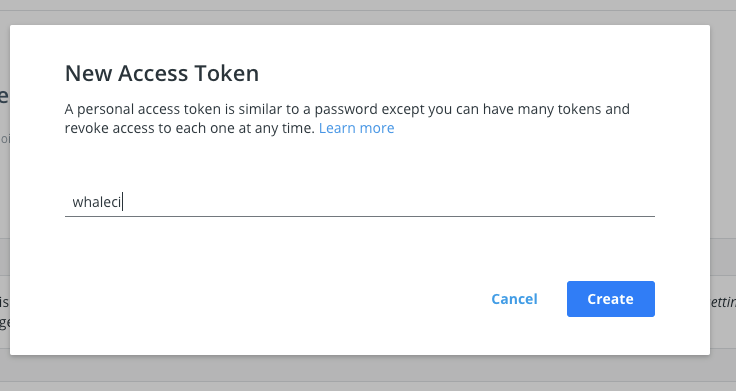
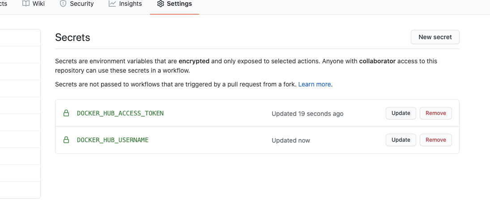

### Site
- You can check this [link](http://35.187.255.137/) to watch . 

### Composition of Project
- #### Back-End: 
    - FastAPI: Python web Framework which support async style function as more easily. Developed API on top of this framework.
    - Postgres + Postgis: Database which support complex query to handle geometric data. I saved coordinates data and query these db. 
    - Pytest: Write testcase to make clean code.  
    - Docker: Build Entire system with Docker image. 
    - Kubernetes: Deploy Docker image with kubernetes on Production system. 
- #### FrontEnd:
    - ReactJS: Javascript Library which helps to build user interfaces Webframework. 
    - NextJS: Framework to help development and deployment of React App which support server side rendering. 
    - MaterialUI: Design Helper library which support basic design tools and grid system to build responsive website more easily. 


### Prerequisite
- docker-compose
- [skaffold](https://skaffold.dev/docs/install/) (For Production deployment purpose)


### Start on Local environment. 

-  You can start project with following comment which help us to run docker images and prepare initial data. 
```
make init
```
- After that you can restart following commands. 
```
docker-compose up -d --build
```
### Deploy on Kubernetes environment
```
skaffold run --default-repo='Your docker repo name'
```

### Further Reivision of Schema.
```
alembic revision --autogenerate -m "Your commit messages"
alembic upgrade head
```

### Github Action Settings. 
The first thing I need to do is to ensure that I will be able to access Docker Hub from any workflow I create, to do this I will need to add my DockerID and a Personal Access Token (PAT) as secrets into GitHub. I can get a PAT by going to https://hub.docker.com/settings/security and clicking ‘new access token’, in this instance I will call my token ‘whaleCI’


I can then add this and my username as secrets into the GitHub secrets UI:


Great we can now start to set up our action workflow to build and store our images in Hub. In this CI flow I am using two Docker actions, the first allows me to log in to Docker Hub using my secrets store in my GitHub Repository. The second is the build and push action, in this I am setting the push flag to true (as I want to push!) and adding in my tag simply to always go to latest. Lastly in this I am also going to echo my image digest to see what was pushed. 

